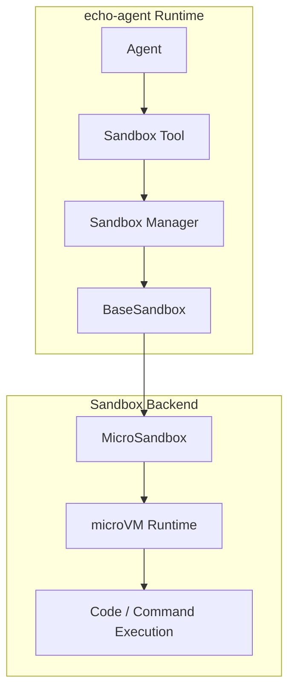
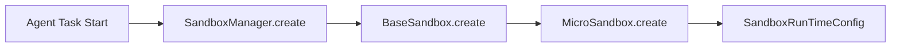
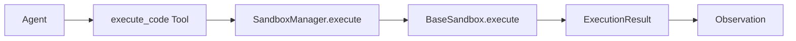
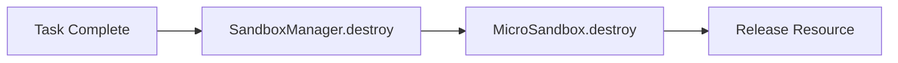
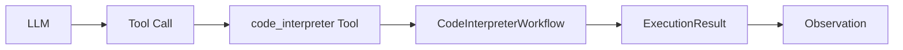
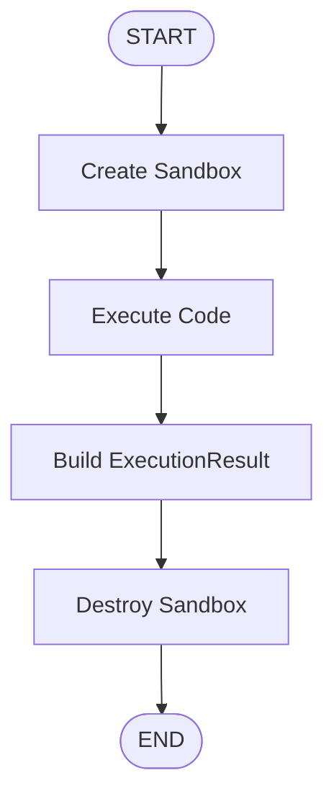
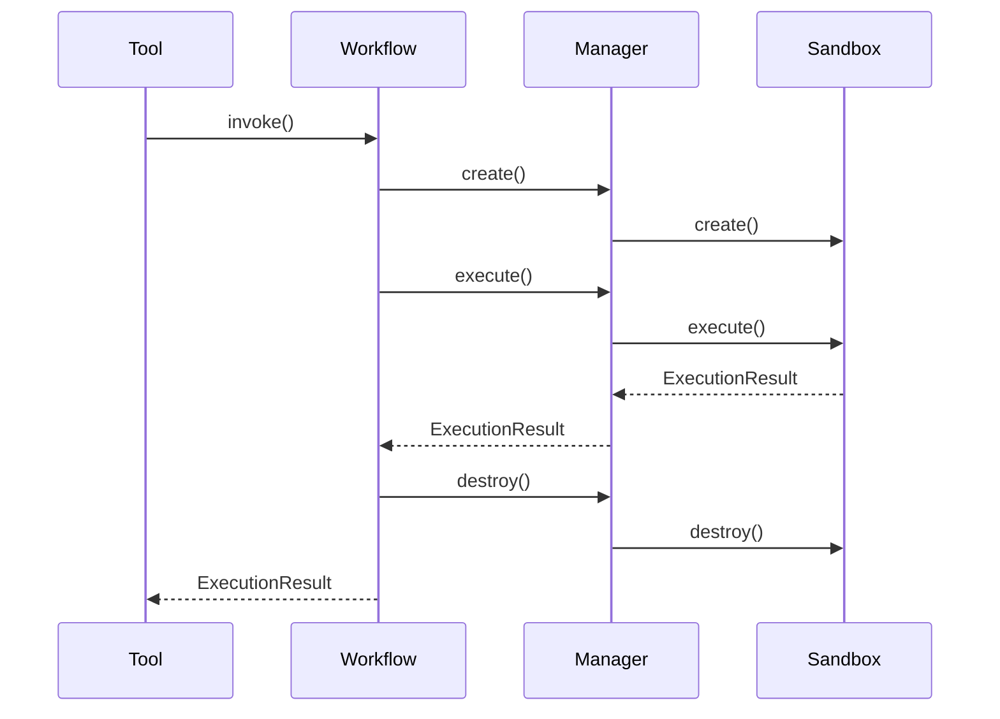
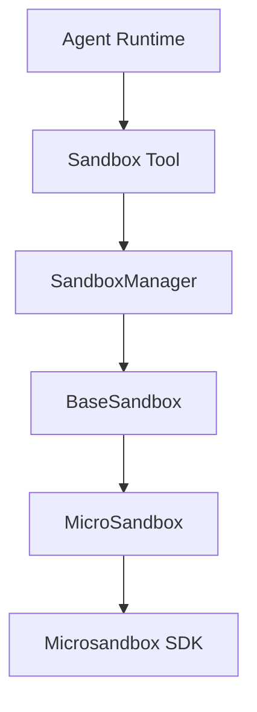

# Sandbox v0.1.0 设计文档

## 1. 背景

随着 Agent 能力增强，代码执行、文件处理、环境操作等场景逐渐成为 Agent Runtime 的基础能力。传统方案通常需要自行实现 Sandbox，包括：

- 进程隔离
- 文件系统隔离
- 网络限制
- 资源限制
- 权限控制

但是 Sandbox 本身属于操作系统安全隔离领域，**自研成本高、风险大**。因此，echo-agent v0.1.0 不自行实现 Sandbox，而采用社区成熟方案，通过抽象统一接口接入外部 Sandbox Runtime。当前选择：

- Sandbox Backend：Microsandbox
- 集成方式：SDK/API 集成
- echo-agent 负责：
  - Sandbox 生命周期管理
  - Agent 调用接口
  - 执行结果标准化

Microsandbox 负责：

- 安全隔离
- microVM 生命周期
- 资源隔离
- 执行环境管理

---

## 2. 设计目标

### 2.1 核心目标

构建一个可扩展的 Sandbox 抽象层，使 Agent Runtime 不依赖具体 Sandbox 实现。目标：

```text
Agent Runtime
      |
Sandbox Interface
      |
Microsandbox
```

### 2.2 非目标

v0.1.0 不实现：

- 自研隔离机制
- Docker Sandbox
- Firecracker 管理
- Kernel 安全策略
- 网络代理
- 文件同步系统
- Sandbox 调度系统

以上能力由 Sandbox Backend 提供。

---

## 3. 整体架构

### 3.1 架构图



---

## 4. 模块设计

### 4.1 sandbox 模块结构

```text
echo_agent
|
└── sandbox
    ├── base.py
    ├── models.py
    ├── microsandbox.py
    └── manager.py
```

---

## 5. 核心模型设计

### 5.1 BaseSandbox

- **职责**
  Sandbox 抽象基类，定义统一 Sandbox 生命周期接口，但不包含：具体 Sandbox 实现逻辑、Backend 特有参数。

```python
class BaseSandbox(ABC):
    """
    Sandbox 抽象基类
    """
    @abstractmethod
    async def create(
        self,
        config: SandboxConfig
    ) -> SandboxRunTimeConfig:
        pass

    @abstractmethod
    async def execute(
        self,
        runtime_config: SandboxRunTimeConfig,
        command: str,
        args: list[str] | None = None
    ) -> ExecutionResult:
        pass

    @abstractmethod
    async def destroy(
        self,
        runtime_config: SandboxRunTimeConfig
    ):
        pass
```

### 5.2 SandboxConfig

- **职责**
  描述 Sandbox 创建配置，包括：
  - 创建前配置
  - 静态配置

```python
class SandboxConfig(BaseModel):
    """
    Sandbox 创建配置

    Attributes:
        name: Sandbox 名称
        image: Sandbox 镜像
        cpu_limit: Sandbox 最大 CPU 限制
        memory_limit: Sandbox 最大内存限制
        timeout: Sandbox 超时时间
        network_enabled: 是否启用网络
        environment: Sandbox 环境变量
    """
    name: str | None
    image: str
    cpu_limit: int | None
    memory_limit: int | None
    timeout: int | None
    network_enabled: bool
    environment: dict[str, str]
```

- **设计原则**
  SandboxConfig 不绑定具体 Backend。

```python
# 错误
class SandboxConfig:
    firecracker_kernel: str
    docker_runtime: str

# 正确
class SandboxConfig:
    resource_limit
    network_policy
    environment
```

### 5.3 SandboxRunTimeConfig

- **职责**
  表示运行中的 Sandbox 状态。包含：sandbox id、当前状态(status)、runtime metadata。

```python
class SandboxRunTimeConfig(BaseModel):
    """
    Sandbox 运行时配置

    Attributes:
        id: Sandbox ID
        status: 状态
        created_at: 创建时间
        metadata: 运行时元数据
    """
    id: str
    status: SandboxStatus
    created_at: datetime | None = None
    metadata: dict[str, Any]
```

- **状态定义**

```python
class SandboxStatus(Enum):
    CREATED = "created"
    RUNNING = "running"
    STOPPED = "stopped"
    FAILED = "failed"
```

- **metadata设计**

本版本设计如下：

```json
{
    "backend":"microsandbox",
    "runtime_id":"xxx"
}
```

后续根据需求可拆分：`SandboxNetworkInfo`、`SandboxResourceInfo`、`SandboxBackendInfo`。

### 5.4 ExecutionResult

- **职责**
  统一 Sandbox 执行结果。包含：是否成功、标准输出、标准错误、退出码、执行时间、运行时元数据。

```python
class ExecutionResult(BaseModel):
    """
    Sandbox 执行结果

    Attributes:
        success: 是否成功
        stdout: 标准输出
        stderr: 标准错误
        exit_code: 退出码
        duration: 执行时间
        metadata: 运行时元数据
    """
    success: bool
    stdout: str
    stderr: str
    exit_code: int | None
    duration: float | None
    metadata: dict[str, Any]
```

- **设计目标**
  统一不同Sandbox Backend的返回结构。

### 5.5 SandboxManager

- **职责**
  Sandbox 生命周期管理入口，屏蔽具体 Sandbox Backend，负责：
  - 创建 Sandbox
  - 保存 RuntimeConfig
  - 获取 Sandbox
  - 执行任务
  - 销毁 Sandbox

```python
class SandboxManager:

    async def create(
        self,
        config: SandboxConfig
    ) -> SandboxRunTimeConfig:
        pass


    async def execute(
        self,
        sandbox_id: str,
        command: str
    ) -> ExecutionResult:
        pass


    async def destroy(
        self,
        sandbox_id: str
    ):
        pass
```

---

## 6. Microsandbox 集成

### 6.1 MicroSandbox

- **职责**
  - 调用 Microsandbox SDK
  - 参数转换
  - 结果转换

```python
class MicroSandbox(BaseSandbox):
    pass
```

### 6.2 映射关系

- **SandboxConfig**
  将SandboxConfig转换为Microsandbox Config。例如：`cpu_limit -> microvm cpu`、`memory_limit -> microvm memory`
- **ExecutionResult**
  将Microsandbox Result转换为ExecutionResult。

---

## 7. Sandbox 生命周期

### 7.1 创建



### 7.2 执行



### 7.3 销毁



---

## 8. Agent Tool 集成

v0.1.0 提供：`code_interpreter` Tool，用于在隔离环境中执行代码。Tool 仅作为 Agent 对 Sandbox 能力的统一入口，不负责 Sandbox 生命周期管理及业务流程编排，而是将请求交由`CodeInterpreterWorkflow` 执行。

- **Schema**

```json
{
  "name": "code_interpreter",
  "description": "Execute code in an isolated sandbox environment.",
  "parameters": {
    "language": {
      "type": "string",
      "description": "Programming language"
    },
    "code": {
      "type": "string",
      "description": "Source code to execute"
    }
  }
}
```

执行流程：



---

## 9. CodeInterpreterWorkflow

- **职责**
  `CodeInterpreterWorkflow` 是 Runtime 内部独立 Workflow，用于完成代码解释执行的完整流程。负责：
- 创建 Sandbox
- 执行代码或命令
- 收集执行结果
- 销毁 Sandbox
- 异常处理及资源释放

Workflow 对 Agent 和 Tool 层透明，调用方无需感知 Sandbox 生命周期。

- **Workflow 流程**



当 Workflow 执行过程中发生异常时，应保证 Sandbox 能够被正确销毁，避免资源泄漏。

- **Workflow 内部流程**



---

## 9. 依赖关系



---

## 10. v0.1.0 实现范围

- **必须实现**
  - [ ]  sandbox module
  - [ ]  BaseSandbox
  - [ ]  SandboxConfig
  - [ ]  SandboxRunTimeConfig
  - [ ]  ExecutionResult
  - [ ]  MicroSandbox Backend
  - [ ]  SandboxManager
  - [ ]  code_interpreter + CodeInterpreterWorkflow / WorkflowGraph
- **暂不实现**
  - [ ]  文件上传下载
  - [ ]  Volume Mount
  - [ ]  Snapshot
  - [ ]  Sandbox Pool
  - [ ]  多 Agent Sandbox 共享
  - [ ]  Sandbox 权限策略

---

## 11. 后续计划演进方向

### v0.2

增加：

- 文件管理能力
- Sandbox Session
- Tool Policy

### v0.3

增加：

- Sandbox Pool
- 多任务复用
- 资源调度

---

## 12. 总结

echo-agent v0.1.0 Sandbox 设计遵循：**不实现 Sandbox，只实现 Sandbox 接入能力**。Microsandbox 作为 v0.1.0 默认 Sandbox Backend，通过集成 Microsandbox，完成安全执行环境接入。该设计保证：

1. 不承担底层安全风险
2. 保持 Runtime 架构稳定
3. 支持未来替换 Sandbox Backend
4. 与 Agent Tool / Skill / Runtime 架构保持一致
